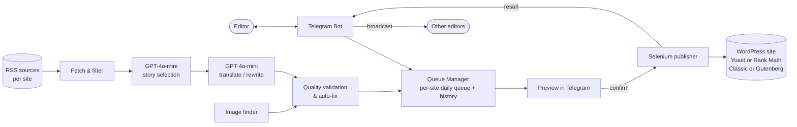

# 📰 MEM Publisher

**AI-powered Arabic news publishing pipeline for 12 WordPress sites** — a Telegram bot that turns RSS feeds into reviewed, SEO-ready Arabic articles and publishes them through browser automation.


> **Showcase repository.** This repo documents the architecture, design decisions and selected code samples of a system that runs in production. The production automation source is not published here.

## Overview

MEM Publisher manages the daily publishing workflow of **12 WordPress news sites**. An editor drives everything from Telegram: build a queue of today's stories, review a preview, confirm, and the system logs in to the site, fills the post (title, body, category, tags, image, SEO fields) and publishes it. It runs 24/7 on a **DigitalOcean VPS (Ubuntu 24.04)**.

WordPress is automated through the real admin UI with Selenium, so no REST API access or plugin installation is needed on the target sites.

## Architecture



## Publishing pipeline

1. **RSS** – collect today's items from each site's own source list (falls back to yesterday's items when the day is quiet).
2. **Filter** – drop opinion pieces, live blogs and low-quality titles in code, apply per-site topic keyword filters, skip anything already published on any site.
3. **GPT selection** – GPT-4o-mini picks the strongest stories for the day and maps each to one of the site's WordPress categories.
4. **GPT rewrite** – faithful Arabic translation/rewrite of the full source text into an original article, with title, tags, focus keyword and meta description.
5. **Validation** – rule checks and automatic repair passes (see below) run before an article reaches the queue.
6. **Telegram preview** – the editor sees title, category and lead paragraph.
7. **Confirm → Selenium publish** – on confirmation the bot publishes and reports the result.

## Features

**Telegram workflow**
- Per-site queue: build, refresh, and publish the next story on demand
- **Preview → confirm → publish** flow, with cancel
- Publish from a link, or paste a manual article (even across several messages) and let the system complete the metadata
- **Broadcast** – other authorized editors are notified when someone publishes
- **Statistics** – publishing counts from the queue history
- Access restricted to allow-listed Telegram user IDs; per-user and global locks keep heavy jobs from running at once on a small VPS

**WordPress automation**
- **Yoast SEO and Rank Math** supported, chosen per site
- **Classic and Gutenberg** editor flows
- **Slug de-duplication** – the slug is set to the focus keyword; if WordPress appends a numeric suffix, alternative keywords are tried before giving up
- Tags, category, featured image and SEO fields filled automatically
- Bulk SEO refresh utility to re-save already published posts so the SEO plugin recalculates its score

**Article-quality rules** (general description)
- Neutral journalistic Arabic, written as an original rewrite rather than a copy of the source
- Paragraph length kept within a target word range, with automatic splitting
- Short articles are expanded automatically
- A single-word focus keyword that must appear in title, lead and meta description, with automatic repair when it doesn't
- Meta description length enforced
- Keyword over-use tracked per site to avoid repetitive slugs
- Source images preferred, with a blocklist for sources that watermark or block downloads

## Tech stack

Python 3 · Selenium · OpenAI API (GPT-4o-mini) · python-telegram-bot · feedparser · requests · python-dotenv · DigitalOcean VPS (Ubuntu 24.04)

## Code samples

The [`examples/`](examples) folder has small, standalone illustrations of two ideas used in the system. They are written for this showcase and are not the production code.

- [`paragraph_rules.py`](examples/paragraph_rules.py) – keep paragraphs inside a word range
- [`slug_dedup.py`](examples/slug_dedup.py) – try alternative keywords when a slug is already taken

## How to run

The production code is not part of this repo, so there is nothing to run end to end here. The configuration it expects looks like this:

```bash
OPENAI_API_KEY=
TELEGRAM_BOT_TOKEN=
TELEGRAM_ALLOWED_USER_ID=        # comma-separated Telegram user IDs
HEADLESS=true
WP_USERNAME_SITE_A=              # one username/password pair per site
WP_PASSWORD_SITE_A=
```

Sites are described in a JSON file (login URL, categories, SEO plugin, optional keyword filter) and each site has its own RSS source list.

## Known limitations

- Selenium selectors depend on WordPress admin, theme and plugin markup, so major UI updates can require selector fixes.
- Articles are generated by an LLM and are meant to be reviewed; the preview step exists for that reason.
- Output language is Arabic only.
- Chrome and LLM jobs are serialized because the VPS has limited RAM.
- No automated test suite; behavior is checked with draft-mode runs on real sites.
- RSS sources are curated by hand per site.

## Author

**Saed O S Radi** · [GitHub @SaadOsama10](https://github.com/SaadOsama10)
